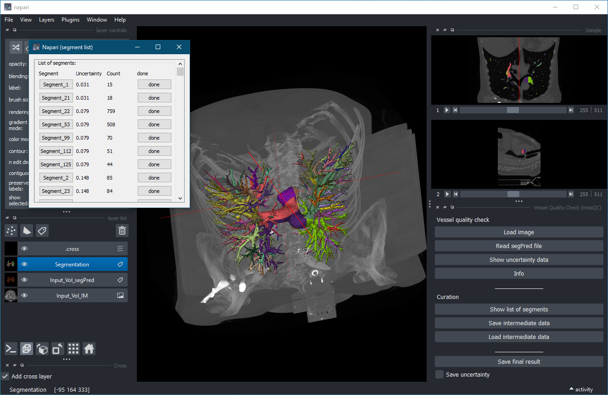

# VessQC

[](https://github.com/MMV-Lab/VessQC/raw/main/LICENSE)
[](https://pypi.org/project/VessQC)
[](https://python.org)
[](https://github.com/MMV-Lab/VessQC/actions)
[](https://codecov.io/gh/MMV-Lab/VessQC)
[](https://napari-hub.org/plugins/VessQC)

A napari plugin for uncertainty-based quality control and manual correction of 3D blood vessel segmentations.

---

## Overview

VessQC is a plugin for the image viewer [napari](https://github.com/napari/napari).
It is designed for the inspection and correction of 3D vessel segmentations generated by machine-learning pipelines.

The plugin combines:

- visualization of image, segmentation, and uncertainty data,
- automatic grouping of uncertain regions into segments,
- interactive review of suspicious regions,
- manual correction of segmentation masks,
- export of corrected segmentation results.

The plugin is particularly useful for workflows in which:

- a neural network generates vessel segmentations,
- uncertainty maps are available,
- only uncertain regions should be reviewed manually.

---

## Screenshot



Suggested repository structure:

```text
VessQC/
├── docs/
│   └── images/
│       └── vessqc_screenshot.png
```

The screenshot should ideally show:

- the main VessQC control panel,
- the image layer,
- the segmentation layer,
- a selected vessel segment,
- the segment list window.

---

## Installation

Install the released version from PyPI:

```bash
pip install VessQC
```

Install the latest development version from GitHub:

```bash
pip install git+https://github.com/MMV-Lab/VessQC.git
```

---

## Input Data

VessQC expects three volumetric datasets:

1. Original image data
2. Predicted vessel segmentation (`*_segPred`)
3. Uncertainty map (`*_uncertainty`)

Supported file formats:

- TIFF (`.tif`, `.tiff`)
- NIfTI (`.nii`, `.nii.gz`)

Example:

```text
Sample_IM.tif
Sample_segPred.tif
Sample_uncertainty.tif
```

---

## Usage

### 1. Load the image

Press:

```text
Load image
```

and select the original 3D image.

---

### 2. Load segmentation and uncertainty data

Press:

```text
Read segPred file
```

The plugin automatically searches for matching:

- `*_segPred`
- `*_uncertainty`

files in the same directory.

The uncertainty map is segmented into connected uncertain regions.

---

### 3. Review uncertain segments

Press:

```text
Show list of segments
```

A separate window displays all detected uncertain regions.

For each segment the following information is shown:

- segment name,
- uncertainty value,
- voxel count,
- processing state.

---

### 4. Inspect a segment

Click a segment button to:

- zoom into the corresponding region,
- crop the surrounding image data,
- display the local segmentation,
- center the viewer on the selected segment.

---

### 5. Correct the segmentation

Use the standard napari label editing tools to:

- add missing vessel voxels,
- remove incorrect voxels,
- refine the segmentation mask.

After correction press:

```text
done
```

The modifications are transferred back into:

- the segmentation volume,
- the uncertainty map,
- the internal label representation.

---

### 6. Save the result

Press:

```text
Save final result
```

The corrected segmentation is written to disk as:

```text
*_segPredNew.tif
```

Optionally the corrected uncertainty map can also be saved.

---

## Intermediate Data

VessQC can store intermediate processing results in the temporary directory.

The following data are saved:

- segmentation volume,
- uncertainty volume,
- label volume,
- segment metadata.

This allows interrupted curation sessions to be resumed later.

---

## Development

Run the test suite with:

```bash
pytest
```

---

## Contributing

Contributions and bug reports are welcome.

Please include:

- a detailed problem description,
- steps to reproduce the issue,
- example data if possible.

---

## License

Distributed under the terms of the BSD-3 license.

---

## Repository

GitHub repository:

https://github.com/MMV-Lab/VessQC
